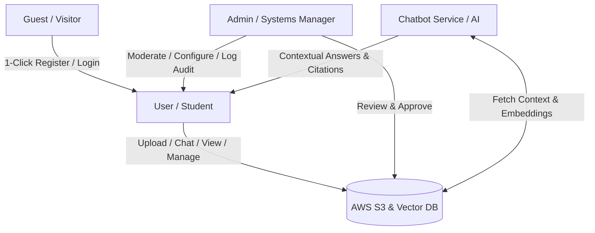

# Project Context Analysis: AI Study Hub

This document establishes the project context, technical architecture, feature scope, and business logic for the **AI-Powered Study Document Management System (AI Study Hub)**, distilled from the business requirements and vision documentation.

---

## 1. Project Overview & Context

University students face massive information overload and highly fragmented study material storage. Documents (slides, past exams, notes) are scattered across Google Drive, email, Zalo, Messenger, and local drives. This results in lost files, zero knowledge sharing between student cohorts, and hours wasted searching or parsing long academic papers.

**AI Study Hub** resolves this by providing a unified cloud-based document repository combined with an **AI RAG (Retrieval-Augmented Generation) Chatbot** that allows students to interact directly with their documents.

### Key References
- Business Requirements: [AI-Study-Hub-BRD.md](file:///Users/chithien/code/SWP_Project/AI-Study-Hub-BRD.md)
- Vision & Scope: [vision-scope-ai-study-hub.md](file:///Users/chithien/code/SWP_Project/vision-scope-ai-study-hub.md)

---

## 2. Business Objectives & Success Metrics

The success of the platform depends on reaching specific business and technical benchmarks:

| Category | Metric / Objective | Target Value |
| :--- | :--- | :--- |
| **Business** | User Migration Rate | Centralize $\ge$ 80% of target students in partner universities within 6 months |
| **Business** | Search Time Reduction | 70% decrease in document search times for active users |
| **Business** | Reading/Summarizing Boost | 50% decrease in paper/slide reading times |
| **Business** | Conversion Rate | $\ge$ 5% conversion from Free to Premium subscription within 6 months |
| **System** | AI Response Latency | $<$ 5 seconds for RAG chat on documents under 100 pages |
| **System** | AI Citation Accuracy | $\ge$ 90% accuracy in referencing sources (limiting hallucinations) |
| **System** | Full-Text Search Speed | $<$ 1.5 seconds for query execution |
| **System** | Document Preview Render | $<$ 3 seconds to display PDF/Word online |

---

## 3. Actors & Roles

The system interacts with four primary actors, each with defined access scopes:

1. **Guest (Visitor):** Unauthenticated. Can access the landing page, view mockups/features, and register/login (with 1-click Google OAuth2 integration).
2. **User (Student/Learner):** Authenticated. Manages personal private folders/documents, tags files, performs full-text search, initiates AI RAG chats, shares documents to the public library, and manages payment subscriptions.
3. **Admin (System Administrator):** System auditor. Manages accounts, moderates public library submissions (checking copyright infringement), monitors system performance logs, and tracks subscription revenues.
4. **ChatbotService (System Actor):** AI backend. Handles text chunking, document vectorization (into Vector DB), semantic search retrieval (RAG), and prompts LLM APIs (Gemini/OpenAI) to return responses with precise citations.

---

## 4. Feature Breakdown & Scope (MVP vs. Future)

### Phase 1: MVP Scope (Current Focus)

- **Authentication (FEAT-AUTH):**
  - Traditional Email signup + Activation Link or OTP verification.
  - JWT session maintenance.
  - Google OAuth2 1-click login.
  - Profile customization (display name, avatar, password resets).
- **Document Management & Cloud Storage (FEAT-DOC & FEAT-STG):**
  - S3-backed upload for PDF, Word, PowerPoint (under 20MB).
  - Manual tagging on upload for categorization.
  - S3 Signed URLs for secure document access.
  - Online PDF preview rendering in-browser without downloads.
  - Private/Public privacy states (public documents require Admin approval).
- **Advanced Full-Text Search (FEAT-FTS):**
  - Fast search by title and tags.
  - Deep content indexing within PDFs to return matching lines and snippets.
- **Contextual RAG AI Assistant (FEAT-AI-RAG):**
  - Instant PDF summaries.
  - Multi-document context selection (chatting with a single file or a whole folder).
  - Citations including file names and page numbers.
  - Conversational history tracking (renaming/deleting chat sessions).
- **Monetization & Limits (FEAT-MON):**
  - Subscription usage dashboard.
  - VietQR/MoMo sandbox payments with automated webhook activation.
  - Rate-limiting middleware (AI Guard) to enforce quotas.
  - Storage enforcement logic for downgraded accounts.

### Phase 2: Future Scope

- **Social Hub (FEAT-SOC):**
  - 1-5 star ratings, comments, and reports under public files.
  - "Trending" algorithm on landing/home pages based on social interaction.
- **Smart AI Upgrades:**
  - AI Auto-tagging based on content analysis.
  - Multimodal RAG (processing charts and images inside PDFs).
  - Automated Mindmap and Flashcard generators from uploads.
- **Advanced Monetization:**
  - Group and classroom shared workspace subscription plans.
  - Gamified Points System (earning tokens/premium days when public documents get highly downloaded/rated).

---

## 5. Subscription & Monetization Logic

The MVP implements a strict subscription and rate-limiting scheme to manage LLM API costs and cloud storage bills.

### Subscription Tiers

| Feature / Limit | Free Plan | Premium Plan |
| :--- | :--- | :--- |
| **Cloud Storage** | 200 MB | 10 GB |
| **Daily AI Requests** | 15 chats/day | 500 chats/day |
| **Cost** | 0 VND | Paid (e.g. Monthly cycle) |

### Key Business Rules
1. **Daily Reset:** Daily AI request quotas reset automatically every 24 hours.
2. **Subscription Cycle:** Premium subscription runs on a strict **30-day billing cycle**.
3. **Automatic Downgrade:** If the subscription is not renewed at the end of the 30-day cycle, the user account degrades from **Premium** to **Free**.
4. **Storage Penalty Lock:**
   - If a downgraded account's data size exceeds the **Free limit (200MB)**, the system **locks** the following actions:
     - Uploading new files.
     - Viewing/previewing files on the *My Documents* dashboard.
     - Using AI chat.
   - The user has two ways to resolve the storage lock:
     - **Renew** the Premium subscription.
     - **Delete** excess files until the storage is $\le$ 200MB.

---

## 6. Critical Technical Constraints & Risks

- **Context Window Limits:** To avoid high API costs and latency, the total context sent to the LLM per chat session must not exceed **150 pages (~60k words)**. The frontend/backend must prompt users to refine their document selection if this is exceeded.
- **Copyright Violations:** Users might upload copyrighted textbooks or confidential exam questions. Public library uploads must pass a strict admin moderation queue.
- **Hallucinations:** AI answers must use strict groundings and reference precise pages to reduce incorrect info.
- **Webhook Reliability:** Network drops could lose payment callbacks. A background transaction reconciliation engine and manual billing dispute logging must be in place.
